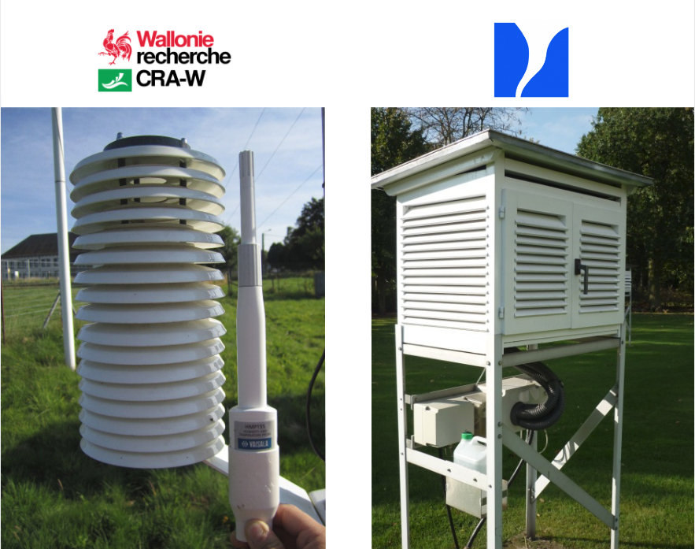

```{r setup, include=FALSE}
#+ ---------------------------------
#' ## Script preparation
#' 
#+ preparation, echo=TRUE, warning=FALSE, message=FALSE, error=FALSE, results='asis'

# Avoid interference with old variables by cleaning the Global Environment
rm(list=ls(all=TRUE))

# Automagically set the wd and the root of all projects 
if (!require("here")) install.packages("here")
library(here)
wd.chr <- here::here()
require(plotly)
require(knitr)
require(broom)
require(mlr)
require(dplyr)

# Defining the .Rmd settings - https://github.com/yihui/knitr/issues/277
knitr::opts_chunk$set(
echo = FALSE,
warning= FALSE,
error= FALSE,
message= FALSE)

# Loading the .RData generared by the .init file
load(file= paste0(wd.chr,"/data-output/big_bmr.RData"))
#source(paste0(wd.chr,"/init.R"))

#integrate font awesome
htmltools::tagList(rmarkdown::html_dependency_font_awesome())
```

# 1. Context & objectives

## 1.1. Integration of the RMI + Pameseb AWS networks

* Agromet : providing hourly gridded (1km²) weather datasets for agricultural decision support system  
* Possibility of RMI stations integration for better spatialization ==> interoperability ?   

## 1.2. Assessing the agreement level between the 2 types of AWS

* previous [work](http://onlinelibrary.wiley.com/doi/10.1002/wea.2158/pdf) by Geoff Jenkins described a comparison method based on regression model correlation study.
* as demonstrated by [Giavarina](https://www.ncbi.nlm.nih.gov/pmc/articles/PMC4470095/), correlation studies is not appropriate to study the differences.
* The alternative [Bland-Altman analysis](https://www-users.york.ac.uk/~mb55/meas/ba.pdf) proposed by the authors is used in this study.

# 2.Data presentation

## 2.1. Period of interest

2 years of hourly records at Humain from `01-nov-2015` to `01-nov-2017` 

## 2.2. Statistics : 

```{r}
kable(dplyr::select(data.frame(no_extra_filter$statistics.l$tsa_stats.df), one_of(c("sid", "mean", "min", "max", "sd", "var", "q25", "q50", "q75"))), caption= "tsa summary stats", digits=2)
```

## 2.3 Time series - full
```{r fig.cap = "Time series"}
no_extra_filter$plots$timeseries.plot$tsa.time.plot
```

## 2.4. Time series - zoom january 2016
```{r fig.cap = "Time series - january 2016 zoom"}
no_extra_filter$plots$january.timeseries.plot$january.tsa.time.plot
```

## 2.5. Time series - zoom august 2016
```{r fig.cap = "Time series - august 2016 zoom"}
no_extra_filter$plots$august.timeseries.plot$august.tsa.time.plot
```

## 2.6. Scatter
```{r fig.cap = "Scatter plot"}
no_extra_filter$plots$scatters.plot$tsa.scatter.plot
```


# 3. First insights

## 3.1. Similarity

Datasets seem in accordance ...

* but to which extent ? 
* How can we quantify this degree of similarity ?  
* Even if a certain degree of similarity : Pameseb is __globally__ warmer
* For the daily max __above 10 °C__ : Pameseb warmer than RMI and the opposite __below 10°C__
* The disparities are generally found around the hours corresponding to daily max temperature.

# 4. Investigating the temperature differences

## 4.1. Bland-Altman analysis - concept

We can use a [Bland Altman analysis](https://pokyah.github.io/howto/assessing-the-agreement-between-two-quantitative-methods-of-measurements-understanding-the-Bland-Altman-analysis/) to measure the agreement level between the 2 stations

It consists to take observations pair by pair and to plot their __means__ vs. their __differences__.

In our case we choose to plot the `IRM - Pameseb` differences.

## 4.2. Bland-Altman Plot

```{r Plot of mean tsa vs. tsaPameseb - tsaIRM}
no_extra_filter$blandAltman$bland_altman.plot
```

----

* 0 is not in the 95% [CI](https://www.mathsisfun.com/data/confidence-interval.html) of the mean difference [`r signif(no_extra_filter$blandAltman$bland_altman.stats.df[2,6], 2)` ; `r signif(no_extra_filter$blandAltman$bland_altman.stats.df[4,6], 2)` ] ==> It exists a mean negative __bias__ of `r signif(no_extra_filter$blandAltman$bland_altman.stats.df[1,3],2)`

* The scatter presents a __negative trend__ going from positive bias to negative bias ==> proportional bias. The methods do not agree equally through the range of measurements. The highest absolute differences are observed at the highest mean temperatures.

* __Below 10 °C__, IRM tends to be warmer (T° difference fluctuates above 0°C) and __above 10°C__, Pameseb tends to be warmer (T°difference fluctuates below 0°C)

## 4.4. A potential explanation : station design

The 2 stations are equipped with different temperature sensors and are actually different in their design : 

* While the __RMI__ is equipped with a __Stevenson radiation screeen mechanically ventiled__, __Pameseb__ is equipped with a __custom screen without mechanical ventilation__.
* The mechanical ventilation pumps air at 50 cm below the sensor height.

----

{ width=50% }

# 5. investigating the potential effect of the mechanical ventilation

## 5.1. Bland-Altman Plot : night only situations

```{r}
night_only$blandAltman$bland_altman.plot
```

---- 

* 0 is not in the 95% CI of the mean difference [`r signif(night_only$blandAltman$bland_altman.stats.df[2,6], 2)` ; `r signif(night_only$blandAltman$bland_altman.stats.df[4,6], 2)` ] ==> It exists a mean positive __bias__ of `r signif(night_only$blandAltman$bland_altman.stats.df[1,3],2)` (IRM globally warmer than Pameseb this time)
* The scatter still presents a negative trend but going from positive bias to __less negative bias__ 

## 5.2. Bland-Altman Plot : daily max +/- 2h situations

```{r}
daily_max_pm2_only$blandAltman$bland_altman.plot
```

----

* 0 is not in the 95% CI of the mean difference [`r signif(daily_max_pm2_only$blandAltman$bland_altman.stats.df[2,6], 2)` ; `r signif(daily_max_pm2_only$blandAltman$bland_altman.stats.df[4,6], 2)` ] ==> It exists a mean negative __bias__ of `r signif(daily_max_pm2_only$blandAltman$bland_altman.stats.df[1,3],2)` (Pameseb globally warmer again)
* The scatter still presents a negative trend but going from __less positive bias__ 


## 5.3. Bland-Altman plots analysis conclusion

* Ventilation system could be a good explanation but only for the negative bias. We need to invoke something else for the positive bias. ==> Pumping of warmer air by IRM during situation of stratified atmosphere ? 

* How to solve the disagreement ==> correction model ! 

# 6. Solving the disagreement

## 6.1. Idea

* Applying a __temperature correction model to Pameseb__ stations prior to the integration of the 2 networks in the spatialization process (we consider RMI as the gold-standard)

* The value of the correction to apply to each observation will be detrmined by a correction model able to predict the observed temperature difference by learning from any combination of `wind speed`, `irradiance` and `temperature` measured at Pameseb.  

* `corr_pameseb_temp = RMI_temp + predicted_temp_diff`

## 6.2. Correction strategies

We can use 2 correction strategies : 

* 1st focusing on the __daily_max +/- 2h__ differences : only corrects observations corresponding to `[-2h; daily max ; +2h]` ==>  <br><small>__train__ set = observations corresponding to High [clearness index](https://www.homerenergy.com/products/pro/docs/3.11/clearness_index.html) values (`ci > q70(ci)`) and __test__ set = observations corresponding to `[-2h; daily max ; +2h]`</small>

* 2nd __non-specific__ approach of the temperature differences. ==><br><small> __train__ and __test__ sets = random split ("holdout") of the whole dataset.</small>

## 6.3. Predictive performance of the models -  daily_max +/- 2h 

```{r}
plotBMRSummary(hci.bmr.l)
```

## 6.4. Predictive performance of the models - non-specific

```{r}
plotBMRSummary(rnd.bmr.l)
```

## 6.5. Predictive performance of the models - interpretation

* In both approaches, the model that presents the lowest mean square error is the one using the 3 variables (`wind speed`, `irradiance` and `temperature`) as predictors.

* For the __non-specific__ approach, the learner that performs the best is the linear regression with a mse of `r getBMRAggrPerformances(rnd.bmr.l)$regr.all.rnd$regr.lm`

* For the __daily_max +/- 2h__ approach, the learner that performs the best is the Fast [k-Nearest Neighbor](https://www.youtube.com/watch?v=3lp5CmSwrHI) with a mse of `r getBMRAggrPerformances(hci.bmr.l)$regr.all.hci$regr.fnn`. By definition it tries to approximate based on some local [vicinity](https://stats.stackexchange.com/questions/240106/intuitions-about-knn-and-linear-regression-in-a-regression-setting) (peaks).

## 6.6. Corrected BA : daily-max +/- 2h 

```{r fig.cap = "Bland-Altman plot - Pameseb corrected by daily temperature peaks approach"}
hci.ba.corr.plots.l$regr.fnn$regr.all.hci$ba_plot
```

---- 
* 0 is in the 95% CI of the mean difference [`r signif(hci.ba.corr.plots.l$regr.fnn$regr.all.hci$ba_stats[2,6], 2)` ; `r signif(hci.ba.corr.plots.l$regr.fnn$regr.all.hci$ba_stats[4,6], 2)` ] ==> no more bias !

* But the negative trend is still visible... ==> we need to build another model for the pumping system
 
## 6.7. Corrected Bland-Altman Plot : non-specific

```{r fig.cap = "Bland-Altman plot - Pameseb corrected by non-specific approach"}
rnd.ba.corr.plots.l$regr.lm$regr.all.rnd$ba_plot
```

----

* 0 is in the 95% CI of the mean difference [`r signif(rnd.ba.corr.plots.l$regr.lm$regr.all.rnd$ba_stats[2,6], 2)` ; `r signif(rnd.ba.corr.plots.l$regr.lm$regr.all.rnd$ba_stats[4,6], 2)` ] ==> no more bias !

* No more negative trend is observable !

## 6.8. Corrected Time-series Plot - zoom august - daily-max +/- 2h 

```{r fig.cap = "Time series - august 2016 zoom Pameseb corrected by daily temperature peaks approach"}
hci.ts.corr.plots.l$regr.fnn$regr.all.hci$august.ts.plot
```

## 6.9. Corrected Time-series Plot - zoom august - non-specific

```{r fig.cap = "Time series - august 2016 zoom Pameseb corrected by non-specific approach"}
rnd.ts.corr.plots.l$regr.lm$regr.all.rnd$august.ts.plot
```

## 6.10. Corrected Time-series Plot - zoom january - daily daily-max +/- 2h 

```{r fig.cap = "Time series - january 2016 zoom Pameseb corrected by daily temperature peaks approach"}
hci.ts.corr.plots.l$regr.fnn$regr.all.hci$january.ts.plot
```

## 6.11. Corrected Time-series Plot - zoom january - non-specific

```{r fig.cap = "Time series - january 2016 zoom Pameseb corrected by non-specific approach"}
rnd.ts.corr.plots.l$regr.lm$regr.all.rnd$january.ts.plot
```

# 7. Conclusions, perspectives and colofon

## Conclusions

* Using Bland-Altman to assess the difference between two datasets, we were able to demonstrate that 2 stations does not record the temperature in similar ways
* Using the power of R - mlr package, we are able to quickly test various correction models and compare their predictions
* Using Pameseb temperature, wind speed and irradiance as explanatory variables, we are able to predict the temperature difference with a mse < 0.10 and to suppress the observed proportional bias

## Perspectives
* improvement 1 : develop 2 correction models ==> one below 10°C and another one above 10°C ?
* Further work : can this correction process be applied asis to all our stations ? For this purpose, we can could compare irradiance patterns from [close stations](https://app.pameseb.be/fr/stations-pameseb/) : (Ernage vs. Sombreffe) + (Buzenol vs. Ruette). if they behave the same as Humain ==> correction model transposable
* Once finished, we plan to submit this work to the ["Weather" Journal of the RMETS](http://rmets.onlinelibrary.wiley.com/hub/journal/10.1002/(ISSN)1477-8696/aims-and-scope/read-full-aims-and-scope.html) : *Quantitative intercomparison of 2 years hourly records of temperature and relative humidity measured by 2 different types of professional-grade automatic weather stations at Humain, Belgium*
    

## Colofon
* This report is still in major revision phase. __Consider it as a first draft version__.  
* This document was generated using R software with the [knitr library](https://deanattali.com/2015/03/24/knitrs-best-hidden-gem-spin/) 
* The interactive plots are rendered from ggplot by [plotly](https://plot.ly).
* The model definition was performed using the [mlr package](https://mlr-org.github.io)
* The source code of the analysis and this presentation is availbale on [github](https://github.com/pokyah/AWS-Humain-comparison)


## Terms of service 
To use the [AGROMET API](https://app.pameseb.be/fr/pages/api_call_test/) you need to provide your own user token.  
The present script is available under the [GNU-GPL V3](https://www.gnu.org/licenses/gpl-3.0.en.html) license and comes with ABSOLUTELY NO WARRANTY.

Copyright : Thomas Goossens - t.goossens@cra.wallonie.be 2018.  
 
*(This document was generated using [R software](https://www.r-project.org/) with the [knitr library](https://deanattali.com/2015/03/24/knitrs-best-hidden-gem-spin/))*.  

<script>
  $(document).ready(function() {
    $items = $('div#TOC li');
    $items.each(function(idx) {
      num_ul = $(this).parentsUntil('#TOC').length;
      $(this).css({'text-indent': num_ul * 10, 'padding-left': 
          0});
    });
    
  });
</script>
  