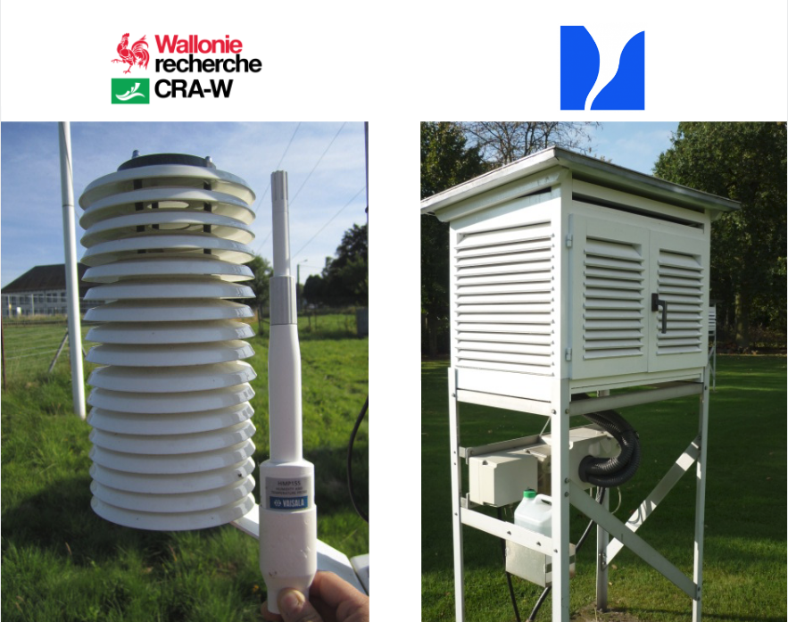

```{r setup, include=FALSE}
#+ ---------------------------------
#' ## Script preparation
#' 
#+ preparation, echo=TRUE, warning=FALSE, message=FALSE, error=FALSE, results='asis'

# Avoid interference with old variables by cleaning the Global Environment
rm(list=ls(all=TRUE))

# Automagically set the wd and the root of all projects 
if (!require("here")) install.packages("here")
library(here)
wd.chr <- here::here()
require(plotly)
require(knitr)
require(broom)
require(mlr)

# Defining the .Rmd settings - https://github.com/yihui/knitr/issues/277
knitr::opts_chunk$set(
echo = FALSE,
warning= FALSE,
error= FALSE,
message= FALSE)

# Loading the .RData generared by the .init file
load(file= paste0(wd.chr,"/data-output/big_bmr.RData"))
#source(paste0(wd.chr,"/init.R"))

#integrate font awesome
htmltools::tagList(rmarkdown::html_dependency_font_awesome())
```

# Context & objectives

## Integration of the RMI + Pameseb AWS networks

* Agromet : providing hourly gridded (1km²) weather datasets for agricultural decision support system  
* Possibility of RMI stations integration for better spatialization ==> interoperability ?   

## Assessing the agreement level between the 2 types of AWS

* previous [work](http://onlinelibrary.wiley.com/doi/10.1002/wea.2158/pdf) by Geoff Jenkins described a comparison method based on regression model correlation study.
* as demonstrated by [Giavarina](https://www.ncbi.nlm.nih.gov/pmc/articles/PMC4470095/), correlation studies is not appropriate to study the differences.
* The alternative [Bland-Altman analysis](https://www-users.york.ac.uk/~mb55/meas/ba.pdf) proposed by the authors is used in this study.


# Data presentation

## Period of interest

2 years of hourly records at Humain from `01-nov-2015` to `01-nov-2017` 

## Statistics : 

```{r}
kable(no_extra_filter$statistics.l$tsa_stats.df, caption= "tsa summary stats", digits=2)
```

## Time series - full
```{r fig.cap = "Time series"}
no_extra_filter$plots$timeseries.plot$tsa.time.plot
```

## Time series - january 2016
```{r fig.cap = "Time series - january 2016 zoom"}
no_extra_filter$plots$january.timeseries.plot$january.tsa.time.plot
```

## Time series - august 2016
```{r fig.cap = "Time series - august 2016 zoom"}
no_extra_filter$plots$august.timeseries.plot$august.tsa.time.plot
```

## Density
```{r fig.cap = "Density"}
no_extra_filter$plots$densities.plot$tsa.dens.plot
```

## Scatter
```{r fig.cap = "Scatter plot"}
no_extra_filter$plots$scatters.plot$tsa.scatter.plot
```

# First insights

## Similarity

Datasets seem in accordance ...

* but to which extent ? 
* How can we quantify this degree of similarity ?  
* Even if a certain degree of similarity : Pameseb is globally warmer
* When temperature > 10 °C : Pameseb warmer than RMI and the opposite below 10°C
* The disparities are generally found around the hours corresponding to daily max temperature.
* What can be infered by studying the temperature differences rather than their correlation ?

# Investigating the temperature difference

## Bland-Altman analysis - concept

We can use a [Bland Altman analysis](https://pokyah.github.io/howto/assessing-the-agreement-between-2-quantitative-methods-of-measurements-understanding-the-Bland-Altman-analysis/) to measure the agreement level between the 2 stations

It consists to take observations pair by pair and to plot their __means__ vs. their __differences__.

In our case we choose to plot `IRM - Pameseb`.

## Bland-Altman Plot

```{r Plot of mean tsa vs. tsaPameseb - tsaIRM}
no_extra_filter$blandAltman$bland_altman.plot
```

## BA interpretation

* For most individuals, measurements made by 2 stations are __more likely to be far apart__ between [`r signif(no_extra_filter$blandAltman$bland_altman.stats.df[1,2], 2)` ; `r signif(no_extra_filter$blandAltman$bland_altman.stats.df[1,4], 2)`] °C.

* 0 is not in the 95% CI of the mean difference [`r signif(no_extra_filter$blandAltman$bland_altman.stats.df[2,6], 2)` ; `r signif(no_extra_filter$blandAltman$bland_altman.stats.df[4,6], 2)` ] ==> It exists a mean negative __bias__ of `r signif(no_extra_filter$blandAltman$bland_altman.stats.df[1,3],2)`

* The scatter presents a __negative trend__ going from positive bias to negative bias ==> proportional bias. The methods do not agree equally through the range of measurements. The highest absolute differences are observed at the highest mean temperatures.

* below 10 °C, IRM tends to be warmer (T° difference fluctuates above 0°C) and above 10°C, Pameseb tends to be warmer (T°difference fluctuates below 0°C)

## A potential explanation : station design

* The 2 stations are actually different in their design. While the __RMI__ is equipped with a __Stevenson radiation screeen mechanically ventiled__, __Pameseb__ is equipped with a __custom screen without mechanical ventilation__. 
* Also, the 2 sensors are not from the same constructor : 

{ width=50% }

# Potential effect of the mechanical ventilation

## Supposition

The lack of ventilation system at Pameseb does not allow to sufficiently compensate the effect of direct solar radiation, potentially leading to an overheating of the Pameseb shelter compared to RMI during situations of high irradiance and low wind.

If true and sufficient ==> the negative differences should be inexistant or at least less pronounced at __night__

## Bland-Altman Plot : night only situations
```{r}
night_only$blandAltman$bland_altman.plot
```

## BA night only situations - interpretation 

* For most individuals, measurements made by 2 stations are more likely to be far apart in a narrower range comprised between [`r signif(night_only$blandAltman$bland_altman.stats.df[1,2], 2)` ; `r signif(night_only$blandAltman$bland_altman.stats.df[1,4], 2)`] °C.  

* 0 is not in the 95% CI of the mean difference [`r signif(night_only$blandAltman$bland_altman.stats.df[2,6], 2)` ; `r signif(night_only$blandAltman$bland_altman.stats.df[4,6], 2)` ] ==> It exists a mean positive __bias__ of `r signif(night_only$blandAltman$bland_altman.stats.df[1,3],2)` (IRM warmer than Pameseb this time)

* The scatter still presents a trend going from positive bias to negative bias.

* ==> The ventilation system is not the only explanation to the proportional bias. The sensitivity of the sensors themselves and/or non-linear differences in radiation transfer effects from the shelters towards the sensors could also possibly explain the observed differences.

# Solving the disagreement

## Idea

* Applying a temperature correction model to Pameseb stations prior to the integration of the 2 networks in the spatialization process (we consider RMI as the gold-standard)

* The value of the correction to apply to each observation will be predicted by a correction model able to predict the observed temperature difference by learning from any combination of `wind speed`, `irradiance` and `temperature` measured at Pameseb.  

* `corr_pameseb_temp = RMI_temp + predicted_temp_diff`

## Correction strategies

Regarding what we have learned from the Bland-Altman plots, we can use 2 correction strategies : 

* 1st focusing on the __daily temperature peaks__ differences : only corrects observations corresponding to `[-2h; daily max ; +2h]` ==>  __train__ set = observations corresponding to High [clearness index](https://www.homerenergy.com/products/pro/docs/3.11/clearness_index.html) values (`ci > q70(ci)`) and __test__ set = observations corresponding to `[-2h; daily max ; +2h]`

* 2nd __non-specific__ approach of the temperature differences. ==> __train__ and __test__ sets = random split ("holdout") of the whole dataset.

## Predictive performance of the models - daily temperature peaks

```{r}
plotBMRSummary(hci.bmr.l)
```

## Predictive performance of the models - non-specific

```{r}
plotBMRSummary(rnd.bmr.l)
```

## Predictive performance of the models - interpretation

* In both approaches, the model that presents the lowest mean square error is the one using the 3 variables (`wind speed`, `irradiance` and `temperature`) as predictors.

* For the __non-specific__ approach, the learner that performs the best is the linear regression with a mse of `r getBMRAggrPerformances(rnd.bmr.l)$regr.all.rnd$regr.lm`

* For the __daily temperature peaks__ approach, the learner that performs the best is the Fast k-Nearest Neighbor with a mse of `r getBMRAggrPerformances(hci.bmr.l)$regr.all.hci$regr.fnn`

* ==> What is the best correction approach ? Let's compare the predictions outputs

## Corrected Bland-Altman Plot - non-specific

```{r fig.cap = "Bland-Altman plot - Pameseb corrected by non-specific approach"}
rnd.ba.corr.plots.l$regr.lm$regr.all.rnd$ba_plot
```

## Corrected BA daily  - Interpretation

* For most individuals, measurements made by 2 stations are more likely to be far apart in a narrower range comprised between [`r signif(rnd.ba.corr.plots.l$regr.lm$regr.all.rnd$ba_stats[1,2], 2)` ; `r signif(rnd.ba.corr.plots.l$regr.lm$regr.all.rnd$ba_stats[1,4], 2)`] °C.  

* 0 is in the 95% CI of the mean difference [`r signif(rnd.ba.corr.plots.l$regr.lm$regr.all.rnd$ba_stats[2,6], 2)` ; `r signif(rnd.ba.corr.plots.l$regr.lm$regr.all.rnd$ba_stats[4,6], 2)` ] ==> no more bias !

* No more negative trend is observable 

## Corrected Bland-Altman Plot - daily temperature peaks

```{r fig.cap = "Bland-Altman plot - Pameseb corrected by daily temperature peaks approach"}
hci.ba.corr.plots.l$regr.fnn$regr.all.hci$ba_plot
```

## Corrected BA non-specific - Interpretation

* For most individuals, measurements made by 2 stations are more likely to be far apart in a narrower range comprised between [`r signif(hci.ba.corr.plots.l$regr.fnn$regr.all.hci$ba_stats[1,2], 2)` ; `r signif(hci.ba.corr.plots.l$regr.fnn$regr.all.hci$ba_stats[1,4], 2)`] °C.  

* 0 is in the 95% CI of the mean difference [`r signif(hci.ba.corr.plots.l$regr.fnn$regr.all.hci$ba_stats[2,6], 2)` ; `r signif(hci.ba.corr.plots.l$regr.fnn$regr.all.hci$ba_stats[4,6], 2)` ] ==> no more bias !

* But the negative trend is still visible... 

## Corrected Time-series Plot - august - daily temperature peaks

```{r fig.cap = "Time series - august 2016 zoom Pameseb corrected by daily temperature peaks approach"}
hci.ts.corr.plots.l$regr.fnn$regr.all.hci$august.ts.plot
```

## Corrected Time-series Plot - august - non-specific

```{r fig.cap = "Time series - august 2016 zoom Pameseb corrected by non-specific approach"}
rnd.ts.corr.plots.l$regr.lm$regr.all.rnd$august.ts.plot
```

## Corrected Time-series Plot - january - daily temperature peaks

```{r fig.cap = "Time series - january 2016 zoom Pameseb corrected by daily temperature peaks approach"}
hci.ts.corr.plots.l$regr.fnn$regr.all.hci$january.ts.plot
```

## Corrected Time-series Plot - january - non-specific

```{r fig.cap = "Time series - january 2016 zoom Pameseb corrected by non-specific approach"}
rnd.ts.corr.plots.l$regr.lm$regr.all.rnd$january.ts.plot
```

# Conclusions, perspectives and colofon

## Conclusions

* Using Bland-Altman to assess the difference between two datasets, we were able to demonstrate that 2 stations does not record the temperature in similar ways
* Using the power of mlr, we are able to quickly test various correction models and compare their predictions
* Using Pameseb temperature, wind speed and irradiance as explanatory variables, we are able to predict the temperature difference with a mse < 0.10 and to suppress the observed proportional bias

## Perspectives
* improvement 1 : develop 2 correction models ==> one below 10°C and another one above 10°C ?
* Further work : can this correction process be applied asis to all our stations ? For this purpose, we can could compare irradiance patterns from [close stations](https://app.pameseb.be/fr/stations-pameseb/) : (Ernage vs. Sombreffe) + (Buzenol vs. Ruette). if they behave the same as Humain ==> correction model transposable
* Once finished, we plan to submit this work to the ["Weather" Journal of the RMETS](http://rmets.onlinelibrary.wiley.com/hub/journal/10.1002/(ISSN)1477-8696/aims-and-scope/read-full-aims-and-scope.html) : *Quantitative intercomparison of 2 years hourly records of temperature and relative humidity measured by 2 different types of professional-grade automatic weather stations at Humain, Belgium*
    

## Colofon
* This report is still in major revision phase. __Consider it as a first draft version__.  
* This document was generated using R software with the [knitr library](https://deanattali.com/2015/03/24/knitrs-best-hidden-gem-spin/) 
* The interactive plots are rendered from ggplot by [plotly](https://plot.ly).
* The model definition was performed using the [mlr package](https://mlr-org.github.io)
* The source code of the analysis and this presentation is availbale on [github](https://github.com/pokyah/AWS-Humain-comparison)


## Terms of service 
To use the [AGROMET API](https://app.pameseb.be/fr/pages/api_call_test/) you need to provide your own user token.  
The present script is available under the [GNU-GPL V3](https://www.gnu.org/licenses/gpl-3.0.en.html) license and comes with ABSOLUTELY NO WARRANTY.

Copyright : Thomas Goossens - t.goossens@cra.wallonie.be 2018.  
 
*(This document was generated using [R software](https://www.r-project.org/) with the [knitr library](https://deanattali.com/2015/03/24/knitrs-best-hidden-gem-spin/))*.  

<script>
  $(document).ready(function() {
    $items = $('div#TOC li');
    $items.each(function(idx) {
      num_ul = $(this).parentsUntil('#TOC').length;
      $(this).css({'text-indent': num_ul * 10, 'padding-left': 
          0});
    });
    
  });
</script>
  
  
  
  
  
  
  